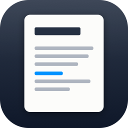

<div align="center">
  
  <h1>MD Reader</h1>
  <p><em>A fast, native macOS reader for Markdown. Not an editor — it opens <code>.md</code> files and gets out of the way.</em></p>
</div>

## Why

Long specifications — tens of thousands of words, hundreds of table rows — are
painful in a general-purpose editor: no outline, no reading progress, no sense of
where you are. MD Reader is built around reading one long document at a time.

## Features

- **Outline sidebar** — every heading, nested, tracking your position as you scroll.
- **Tabs in the toolbar row** — several documents in one window, browser style, each
  tab keeping its own scroll position. The tab *is* the title.
- **Session restore** — reopens the files you had open, with a recents list on the
  start screen.
- **Search** — full-text find, with matches and their surrounding snippets in the
  sidebar.
- **Text size as a percentage** — ⌘+ / ⌘− / ⌘0, or click the number and type one.
  Remembered between launches.
- **Reading progress** in the toolbar.
- **English and Russian**, chosen from the system language — there is no setting.
- Liquid Glass controls on macOS 26, with a material fallback below it.

## Build

```bash
./build.sh release
```

Produces `MD Reader.app` next to the script. Requires macOS 15+ and a Swift 6
toolchain; `swift-markdown-ui` is fetched by SwiftPM, and the app icon is
generated by `tools/make-icon.swift`.

## Install

```bash
./install.sh
```

Builds, copies the app to `/Applications` and registers it with Launch Services.
On first launch the app offers to take over `.md`; you can also pick
**File ▸ Make MD Reader the Default for Markdown…** at any time. Asking from
inside the app matters — an explicit user choice outranks other apps' claims on
the file type, including Xcode's.

## Packaging

```bash
./make-dmg.sh
```

Produces `MD Reader.dmg` — the usual drag-to-Applications window, with the app on
the left, an Applications alias on the right and an arrow between them. The
backdrop is generated by `tools/make-dmg-background.swift`, and the Finder layout
is applied by AppleScript against a mounted writable image before it is frozen
into a compressed one. macOS asks once for permission to control Finder; without
it the image still builds, just with the default plain layout.

The app is ad-hoc signed rather than notarised, so on another Mac the first
launch is blocked. Open it once, then allow it in **System Settings ▸ Privacy &
Security ▸ Open Anyway**. Getting rid of that step needs a paid Developer ID and
notarisation.

## Keyboard

| Shortcut | Action |
|---|---|
| `⌘O` | Open files (multiple selection allowed) |
| `⌘W` | Close tab |
| `⇧⌘]` / `⇧⌘[` | Next / previous tab |
| `⌘F` | Find in document |
| `⌘G` / `⇧⌘G` | Next / previous match |
| `⌘+` / `⌘−` | Bigger / smaller text |
| `⌘0` | Actual size (100%) |
| `⌃⌘S` | Toggle sidebar |

## Licence

MIT
