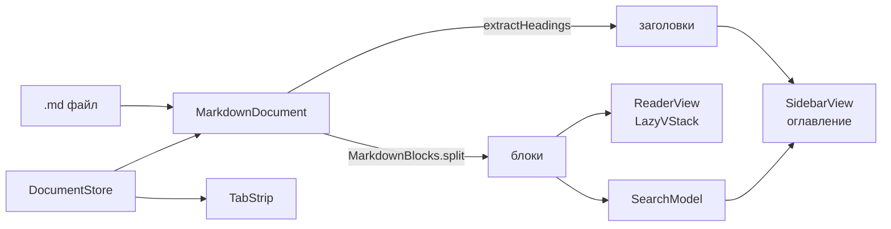

# Архитектура

Одно окно, один документ на вкладке. Всё в одном процессе, без базы и без
собственного сервера — единственный сетевой обмен это фид обновлений.

## Поток

## Из чего состоит

| Файл | Отвечает за |
|---|---|
| `MarkdownDocument` | один открытый файл: текст, заголовки, блоки |
| `MarkdownBlocks` | резка секции на абзацы, списки, таблицы, код |
| `DocumentStore` | вкладки, выделение, сессия, позиции чтения, недавние файлы |
| `ReaderView` | отрисовка документа, скролл, подсветка попадания |
| `SidebarView` | оглавление, результаты поиска, полоса прогресса |
| `SearchModel` | полнотекстовый поиск, сниппеты |
| `TabStrip` | вкладки, переполнение, предпросмотр при наведении |
| `ToolbarLayout` | сколько места осталось вкладкам |
| `ToolbarPriority` | что тулбар жертвует первым |
| `ThemeCache` | тема MarkdownUI, по одной на размер шрифта |
| `UpdateChecker` | проверка, загрузка и подмена себя |

## Единица отрисовки — блок, не секция

Документ режется дважды: сначала на секции по заголовкам (для оглавления), потом
каждая секция — на блоки (для отрисовки и поиска). Блок это абзац, список,
таблица или блок кода.

Почему так и чем за это заплачено — `docs/adr/0001-blocks-not-sections.md`.

## Что сделано ради скорости

Открытие файла на 76 КБ занимало 800 мс до первого кадра, сейчас 84.

- **Парсинг один раз.** `Markdown(String)` запускает разбор CommonMark в своём
  инициализаторе, поэтому в блоках хранится уже разобранный `MarkdownContent`.
  Раньше разбор шёл при каждой отрисовке кадра.
- **Ленивая отрисовка.** `LazyVStack` — раскладывается только видимое. Плата:
  `ScrollView` сообщает оценочную высоту, пока документ не пролистан целиком,
  поэтому процент прочитанного на первом проходе завышает.
- **`EquatableView` вокруг документа.** Пересобирается только при смене документа
  или размера шрифта. Иначе трекинг видимой секции при скролле перекладывал бы
  все таблицы заново.
- **Состояние скролла вне дерева документа.** `ProgressState` и `SectionState` —
  отдельные объекты; за ними следят только полоска прогресса и оглавление, а не
  читалка.
- **Позиция чтения переживает выход.** `DocumentStore.persistScrollPositions`
  складывает в `UserDefaults` идентификатор верхнего блока и долю прокрутки для
  каждого файла. Пишем и при выходе, и при потере фокуса: обработчик выхода —
  ненадёжная точка, поэтому в `Info.plist` обязаны стоять
  `NSSupportsSuddenTermination` и `NSSupportsAutomaticTermination` в `false`.

## Тулбар

Вкладки и контролы — два элемента `NSToolbar`, и место между ними распределяет
система. Приложение вмешивается дважды: считает, сколько осталось вкладкам
(`ToolbarLayout`), и говорит системе, что жертвовать первым
(`ToolbarPriority`). Подробности — `docs/adr/0004-toolbar-priority.md`.

Место под вкладки — `панель − контролы − 180`, но не больше 0.6 панели. Ширина
контролов измеряется живьём, поэтому открытый поиск сразу отодвигает вкладки.
Число вкладок получается само: ширина делится на всех, пока не упрётся в 96 pt,
дальше лишние уходят под свой шеврон.

Два запрета, оба оплачены поломками. **Не мерить кадр самой полосы из вёрстки** —
её положение зависит от ширины, которую публикует `ToolbarLayout`, и замер
закольцовывается: главный поток уходит в вечную раскладку, окно рисуется, но
ничего отложенного больше не выполняется. **Не задавать полосе точную ширину** —
тогда элемент требует именно её, и место теряют уже контролы.

Сверх расчёта — сторож (`ToolbarPriority.tabsAreVisible`): если тулбару всё же
не хватило места и он унёс полосу в свой поповер, вернуться она сама не может,
потому что унесённый элемент перестаёт раскладываться. Сторож отдаёт место и
меняет `id` элемента, заставляя SwiftUI создать его заново.
